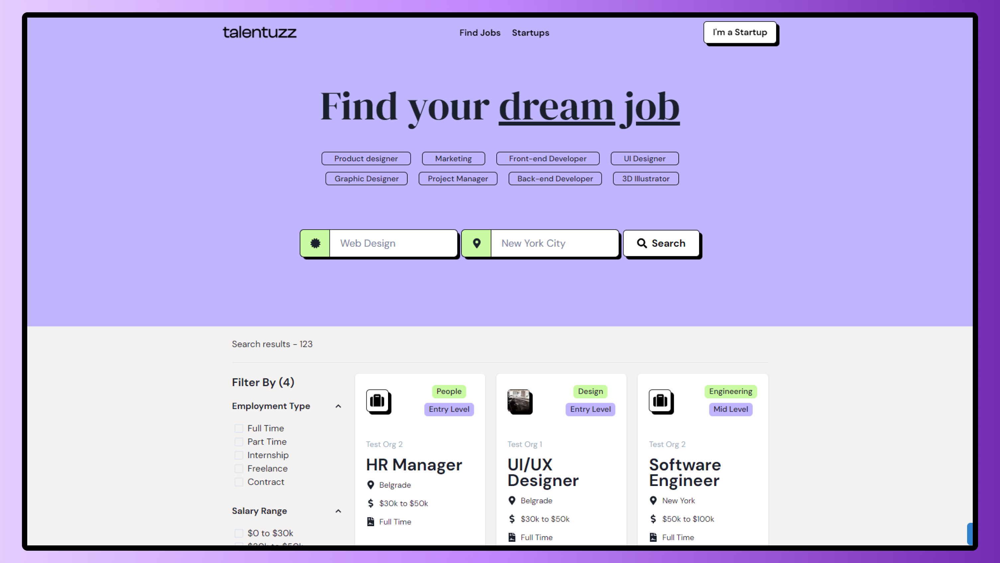

<div align="center">
<a href="https://talentuzz.hnqg.io">

</a>
</div>

<p></p>

<div align="center">
    <a href="#-getting-started">
        Getting Started
    </a>
    <span>&nbsp;❖&nbsp;</span>
    <a href="#-overview">
        Overview
    </a>
    <span>&nbsp;❖&nbsp;</span>
    <a href="#-features">
        Features
    </a>
    <span>&nbsp;❖&nbsp;</span>
    <a href="#%EF%B8%8F-stack">
        Stack
    </a>
    <span>&nbsp;❖&nbsp;</span>
    <a href="https://talentuzz.hnqg.io" target="_blank">
        Deploy ↗︎
    </a>
    <span>&nbsp;❖&nbsp;</span>
    <a href="https://talentuzz-api.onrender.com/docs" target="_blank">
        API Docs ↗︎
    </a>
</div>

<div align="center">

[](https://actions-badge.atrox.dev/hnqg/talentuzz/goto?ref=main)


</div>

## ✌ Please don't forget to leave a star

See more projects at my profile - [@hnqg](https://github.com/hnqg)

# Talentuzz

A hiring platform for startups and the best professionals on the market.

## 🛠️ Stack

- **[Next.js](https://nextjs.org/)** with [TypeScript](https://www.typescriptlang.org/) - The React Framework for Production.
- **[Chakra UI](https://chakra-ui.com/)** - A modular and accessible component library.
- **[React Icons](https://react-icons.github.io/react-icons/)** - Popular icons as React components.
- **[TanStack Query](https://tanstack.com/query/latest)** - Hooks for powerful asynchronous state management.
- **[Zustand](https://github.com/pmndrs/zustand)** - A small, fast and scalable bearbones state-management solution.
- **[React-Hook-Forms](https://react-hook-form.com/)** - Performant, flexible and extensible forms with easy-to-use validation.
- **[Zod](https://zod.dev/)** - TypeScript-first schema validation.

- **[React Testing Library](https://testing-library.com/docs/)** for **Integration Tests** - A light-weight solution for testing React components.
- **[Cypress](https://www.cypress.io/)** for **E2E Tests** - Fast, easy and reliable web testing for any applications or components that run in a browser.
- **[MSW](https://mswjs.io/)** with **[MSW Data](https://github.com/mswjs/data)** - Mock backend by intercepting requests on the network level.
- **[Storybook](https://storybook.js.org/)** with **[CSF3](https://storybook.js.org/blog/component-story-format-3-0/)** - A tool for building and documenting UI components and pages in isolation.

- **[Prettier](https://prettier.io/)** and **[ESLint](https://eslint.org/)** - Linter and formatter.
- **[Husky](https://github.com/typicode/husky)** with **[Lint Staged](https://github.com/okonet/lint-staged)** - Run custom scripts on Git hooks.

## ✨ Features

**General**

- [x] Landing page with general info about the platform.
- [x] The platform should be responsive.
- [x] The platform should integrate with [Talentuzz API](https://github.com/hnqg/talentuzz-api)

**Public user:**

- [x] The user can see a list of jobs and filter.
- [x] The user can see the details of a job.
- [x] The user can see the details of an organization and its jobs.
- [x] The user can apply for a public job by e-mail.

**Organization admin:**

- [x] The admin can login.
- [x] The admin can register (soon) and create its organization.
- [x] The admin can see all the jobs of current organization.
- [x] The admin can create/edit/delete a job.
- [x] The admin can see the details of a job.
- [x] The admin can see and edit the details of current organization.
- [ ] The admin can write the job info with markdown.
  - problems testing with RTL

## 🪐 Overview

- [**/cypress/e2e**](https://github.com/hnqg/talentuzz/tree/main/cypress/e2e) - E2E tests.
- [**/src/**tests\*\*\*\*](https://github.com/hnqg/talentuzz/tree/main/src/__tests__) - Integration tests.
- [**/src/components**](https://github.com/hnqg/talentuzz/tree/main/src/components) - All sharable components with Storybook stories.
- [**/src/config/constants.ts**](https://github.com/hnqg/talentuzz/tree/main/src/config/constants.ts) - All project constants, mostly a "wrapper" for env variables.
- [**/src/layouts**](https://github.com/hnqg/talentuzz/tree/main/src/layouts) - Auth, Dashboard and Public layout components.
- [**/src/lib**](https://github.com/hnqg/talentuzz/tree/main/src/lib) - Wrapper for custom configuration and use of external libraries.
- [**/src/providers**](https://github.com/hnqg/talentuzz/blob/main/src/providers) - App provider with all system providers.
- [**/src/stores**](https://github.com/hnqg/talentuzz/blob/main/src/stores) - Global stores.
- [**/src/testing**](https://github.com/hnqg/talentuzz/blob/main/src/testing) - Jest config, test utils, msw configuration.
- [**/src/testing/mocks/db.ts**](https://github.com/hnqg/talentuzz/blob/main/src/testing/mocks/db.ts) - Data modeling.
- [**/src/testing/mocks/handlers**](https://github.com/hnqg/talentuzz/blob/main/src/testing/mocks/handlers) - API endpoints interceptors.
- [**/src/theme**](https://github.com/hnqg/talentuzz/blob/main/src/theme) - Chakra UI theme. Global, components and foundations styles.
- [**/src/utils**](https://github.com/hnqg/talentuzz/blob/main/src/utils) - Util functions.
- [**/src/features**](https://github.com/hnqg/talentuzz/blob/main/src/features) - Auth, jobs, landing and organizations files.
  - **api** - API calls and custom hooks on top TanStack Query.
  - **data** - Information used in components and functions of the feature. (Usually a JSON)
  - **stores**
  - **components**
  - **types**
  - **utils**
  - **index.ts** - API for the current feature, only exports what's used by external actors of the application.

## 🚀 Getting Started

### **Project settings:**

1. Clone or [fork](git@github.com:hnqg/talentuzz.git) the repository:

```bash
git@github.com:hnqg/talentuzz.git
```

2. Install dependencies with your favorite package manager:

```bash
# with npm:
npm install
# with pnpm:
pnpm install
# with yarn:
yarn install
# with ultra:
ultra install
```

### **Environment variables:**

3. Copy the `.env.example` file in a `.env`:

```env
cp .env.example .env
```

### **Run the project:**

4. Run in your terminal:

```bash
# with npm:
npm run dev
# with pnpm:
pnpm run dev
# with yarn:
yarn dev
# with ultra:
ultra dev
```

and open [http://localhost:3000](http://localhost:3000) 🚀.

## 😊 Contributing

<a href="https://github.com/hnqg/talentuzz/graphs/contributors">
  
</a>

<p></p>

## ☁ Deploy

- **Vercel**: [https://talentuzz.hnqg.io](https://talentuzz.hnqg.io)

🐲 From [Henrique Gonçalves](https://github.com/hnqg) (or hnqg if you prefer), you can find me at [](https://www.instagram.com/_hnqg/) [](https://www.linkedin.com/in/henriiqueg/)
